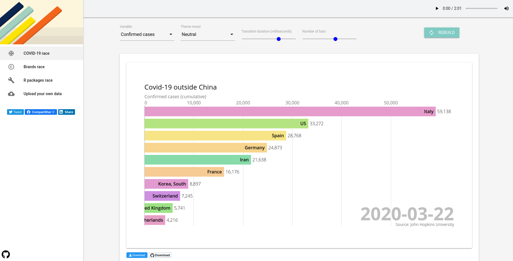
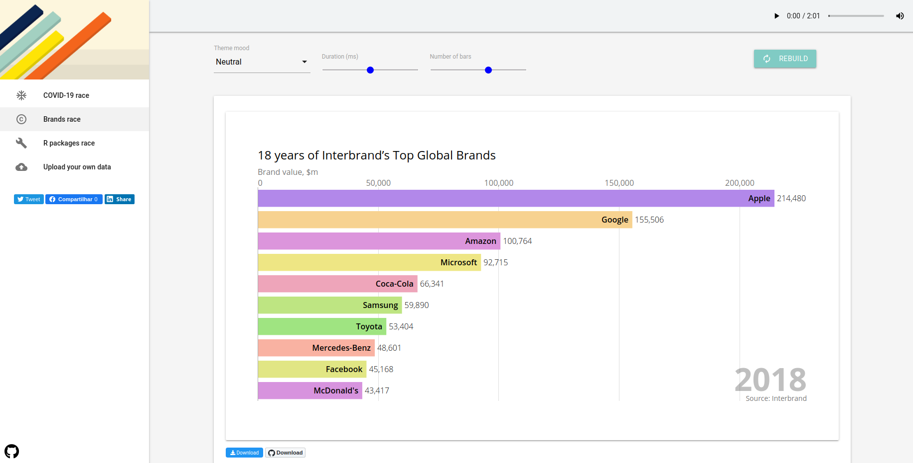
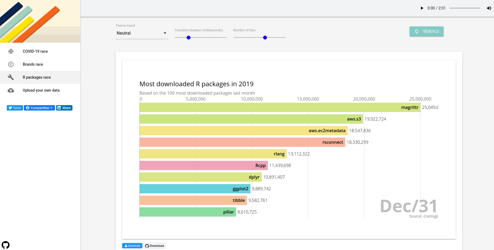
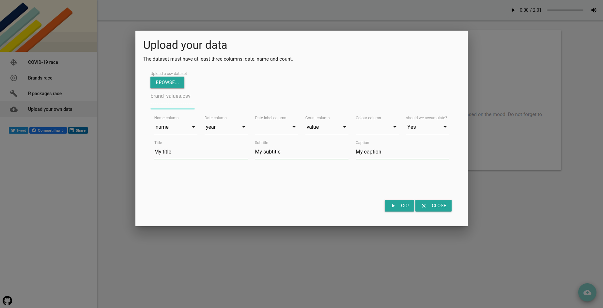
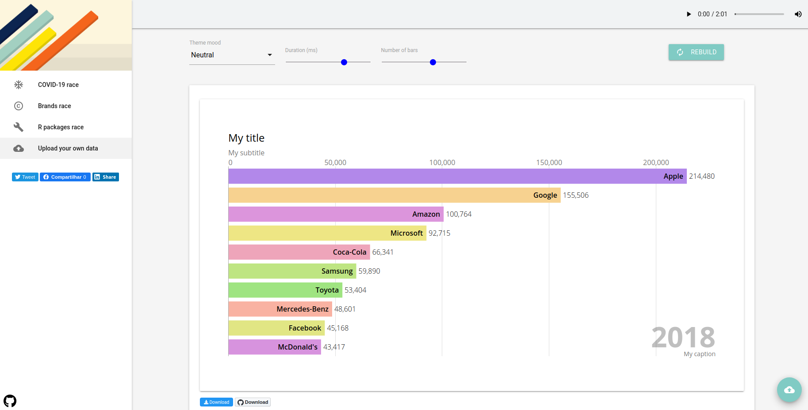

# barchartraceR2D3 

## About the app

**barchartraceR2D3** implements the bar chart race in D3 providing a
function to execute it in R.

## Links

  - Live version: [barchartraceR2D3 - Live
    app](https://voronoys.shinyapps.io/barchartraceR2D3/)
  - RStudio cloud: [barchartraceR2D3 - RStudio
    cloud](https://rstudio.cloud/project/1061658)
  - GitHub: [barchartraceR2D3 -
    Github](https://github.com/voronoys/barchartraceR2D3)

## Quick reading: Highlights

The bar chart race is an awesome visualization tool that provides the
evolution of a numerical variable along the time by groups. It is
possible to observe how several groups evolve and the competition among
them.

There are several tools available to create bar chart races. However,
there is no standard tool to create such kind of plot in R. Therefore,
we use a [D3
implementation](https://bl.ocks.org/jrzief/70f1f8a5d066a286da3a1e699823470f)
provided by [Joel Zief](https://bl.ocks.org/jrzief) and after some
customization, we were able to use it as a template for the *r2d3*
package.

Our tool provides three examples as well as a tab in which the user can
introduce their own dataset to create a bar chart race. For each
example, the user can set up some parameters as the number of bars, the
transition speed, and the mood. The latter provides a palette and a song
for a selected mood, helping to create an atmosphere.

## COVID-19 bar chart race

The bar chart race is based on the daily counts of new cases and deaths
provided by the [Johns Hopkins
University](https://github.com/CSSEGISandData/COVID-19) for the new
COVID-19 (coronavirus).

## Brands’ value bar chart race

It is a very common example of bar char races. The data is provided by
[Interbrand](https://www.interbrand.com/best-brands/) and presents the
brand value for several brands around the world showing its evolution
over time.

## Most downloaded R packages in 2019

Based on the top 100 most downloaded R packages last month
(*cranlogs::cran\_top\_downloads*), the bar chart race presents the
cumulative number of downloads of each package from 01/01/2019 until
31/12/2019.

## Create your bar chart race

Following the instructions in the upload tab you can create your bar
chart race based on your dataset. To do so, you must to provide at least
three information: 1) A column indicating the group or name of each bar;
2) A date column or at least a numerical one, and; 3) The value to be
displayed.

In addition, you can also inform the date label to be displayed (the
default is to display the date column) and the color column which can be
a vector of characters or HTML colors (the default is to create a random
palette based on the column group/name). Finally, you can define whether
the values should be accumulated or not (default is ‘Yes’). The title,
subtitle and captions are also required but not mandatory.

Press Go\! to have your bar chart race.

Download and share it\!
